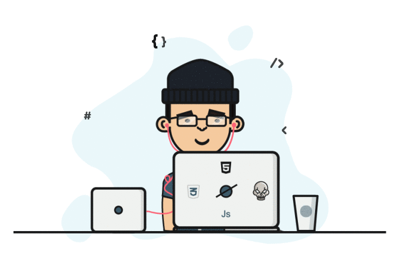

<h1 align="center">
  Hello 
  I'm Arnab Mitra
</h1>

  

  
  
  

  

---

<table>
  <tr>
    <td width="60%" valign="top">
      <h2>👨‍💻 About Me</h2>
      
I'm a developer focused on building clean, practical, and user-friendly digital experiences. I enjoy turning ideas into products that are both functional and polished.

      <ul>
        <li>🔭 Currently working on <code>Something Interesting</code></li>
        <li>🌱 Learning <code>Backend Development</code></li>
        <li>🤝 Open to collaborating on <code>Development Projects</code></li>
        <li>💡 Interested in <code>Competitive Programming</code> and continuous learning</li>
        <li>📚 Always exploring modern tools, frameworks, and engineering best practices</li>
      </ul>
    </td>
    <td width="40%" valign="top">
      
    </td>
  </tr>
</table>

## 🌐 Socials

  

---

# 💻 Tech Stack

                

---

# 📊 GitHub Stats

  

  

  

## 🏆 GitHub Trophies

  

### ✍️ Random Dev Quote

  

