# Hi, I'm Arnab Mitra 👋

### Front-end Developer · React · Next.js · TypeScript

I build clean, responsive, and user-focused web experiences with modern front-end technologies.

  
  
  

---

## 👨‍💻 About Me

I'm a developer focused on building **clean, practical, and user-friendly digital experiences**. I enjoy transforming ideas into responsive products that are both functional and polished.

- 🔭 Currently working on **Something Interesting**
- 🌱 Currently learning **Backend Development**
- 🤝 Open to collaborating on **Development Projects**
- 💡 Interested in **Competitive Programming & Continuous Learning**
- 📚 Exploring modern tools, frameworks, and engineering best practices

---

## 🛠️ Tech Stack

### Frontend

  
  
  
  
  
  
  
  

### Backend & Database

  
  
  
  

### Languages & Tools

  
  
  
  
  

---

## 📊 GitHub Activity

  
  

---

## 🏆 GitHub Achievements

  

---

## 🌐 Connect With Me

  
  
  
  
  

---

Thanks for visiting my profile. Feel free to explore my repositories and connect with me.
